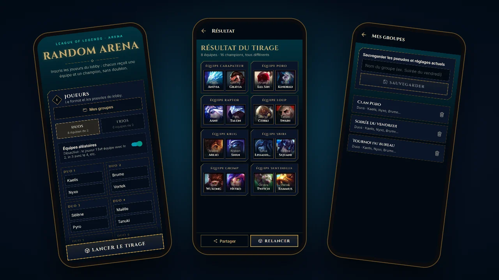
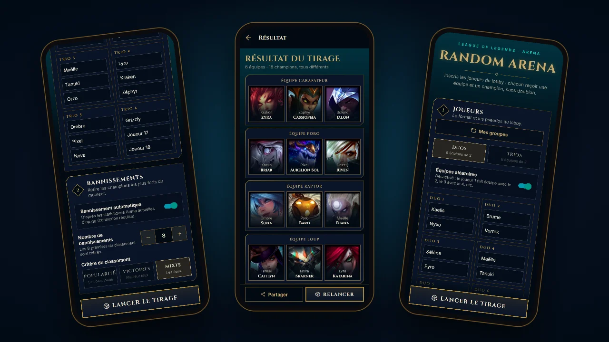

# ⚔️ LoL Random Arena (mobile)

   

> Version mobile de [LoL Random Arena](https://github.com/Forthtilliath/lol-random-arena) : renseigne les joueurs du lobby, l'app forme les équipes du mode Arena de League of Legends et attribue un champion à chacun.



## Fonctionnalités

- 👥 **Duos ou Trios** : 8 équipes de 2 ou 6 équipes de 3
- 🎲 **Équipes aléatoires** ou par ordre d'inscription
- 🏆 **Un champion par joueur, sans doublon**, parmi les 173 champions du jeu, portraits embarqués (fonctionne hors ligne)
- 🚫 **Bannissement automatique** des champions les plus joués, les plus gagnants ou un mix des deux, d'après les statistiques Arena actuelles d'[op.gg](https://www.op.gg/lol/modes/arena) (connexion requise)
- 🔁 **Relancer** un tirage en un geste, **partager** le résultat en texte (Discord, chat du lobby…)
- 💾 **Pseudos retenus automatiquement** d'une ouverture à l'autre, et **groupes sauvegardés** pour changer de bande d'amis en un geste
- 🇫🇷 Interface en français



## Thème « Hextech »

Même identité visuelle que le site : palette du client League of Legends (noir hextech `#010A13`, bleu nuit `#0A1428`, or `#C8AA6E`, bleu hextech `#0AC8B9`), panneaux à coins biseautés dessinés en SVG, titres en Cinzel. Les tokens sont dans [`src/constants/theme.ts`](src/constants/theme.ts), à garder synchronisés avec `src/app.css` du site.

## Stack technique

- [Expo SDK 57](https://docs.expo.dev/) + [Expo Router](https://docs.expo.dev/router/introduction/)
- [React Native 0.86](https://reactnative.dev/) + TypeScript
- [Zustand](https://zustand.docs.pmnd.rs/) + AsyncStorage : configuration, groupes et dernier tirage persistés sur l'appareil
- [Zod](https://zod.dev/) : revalidation des données relues depuis le stockage
- [react-native-svg](https://github.com/software-mansion/react-native-svg), [expo-linear-gradient](https://docs.expo.dev/versions/latest/sdk/linear-gradient/), [expo-image](https://docs.expo.dev/versions/latest/sdk/image/)
- [Data Dragon](https://developer.riotgames.com/docs/lol#data-dragon) : liste des champions et portraits officiels
- [Biome](https://biomejs.dev/) (lint + format), [Jest](https://jestjs.io/) + jest-expo (tests)

## Installation

```bash
git clone https://github.com/Forthtilliath/lol-random-arena-mobile.git
cd lol-random-arena-mobile
npm install
npm start
```

Scanne ensuite le QR code avec l'app [Expo Go](https://expo.dev/go), ou lance `npm run android`.

### Scripts disponibles

| Commande                 | Description                                                                   |
| ------------------------ | ----------------------------------------------------------------------------- |
| `npm start`              | Serveur de développement Expo                                                 |
| `npm run android`        | Ouvre l'app sur Android                                                       |
| `npm test`               | Tests unitaires (Jest)                                                        |
| `npm run typecheck`      | Vérification des types (tsc)                                                  |
| `npm run lint`           | Lint et format (Biome)                                                        |
| `npm run format`         | Corrige le lint et le format                                                  |
| `npm run sync-champions` | Met à jour les champions et leurs portraits depuis Data Dragon                |

Après la sortie d'un nouveau champion, lance `npm run sync-champions` : le script régénère `src/lib/champions.ts` et `src/lib/championImages.ts`, et télécharge les portraits manquants dans `assets/champions/`.

## Licence

Distribué sous licence [MIT](./LICENSE).

LoL Random Arena est un projet de fan non affilié à Riot Games. League of Legends et les portraits des champions sont la propriété de Riot Games, Inc.
